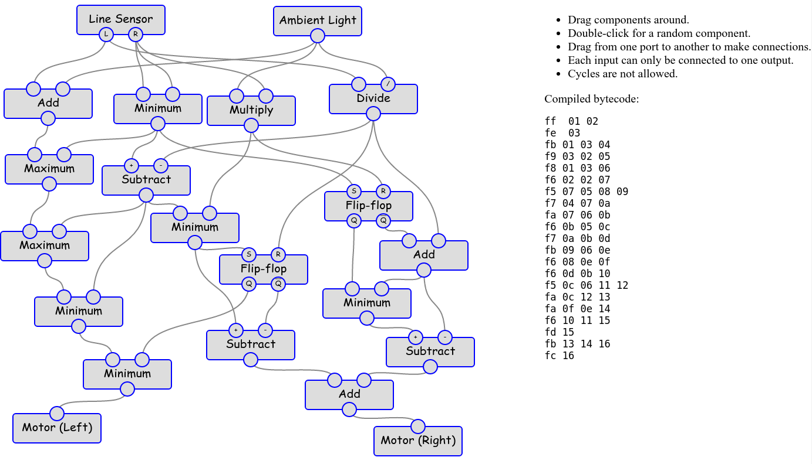

========
 FloBot
========

A visual dataflow language for educational robots, with a
graphical editor which runs in your web browser.

Background
==========

I've been
`playing with <http://nick.zoic.org/etc/mbots-using-nodebot-mblockly-and-arduino/>`_
educational robot programming environments and had
`some thoughts <http://nick.zoic.org/etc/flobot-graphical-dataflow-language-for-robots/>`_
on how they could be improved, so this is an implementation of those ideas.

FloBot runs on the `ESP8266 <http://esp8266.com/>` platform and serves
up its graphical program editor via a built in webserver.  No software 
needs to be installed on PCs, and it works with any modern browser on PCs
or tablets.

FloBot is compatible with 
`NodeMCU <http://nodemcu.com/>`_ (you can buy these on Ebay) or
`Ciril <https://github.com/mnemote/ciril/>`_ (my other project) hardware.

Documentation
=============

I'm doing this in a kind of
document-driven-design kind of way, so here's some initial docs which
describe features some of which don't exist yet:

* `Programmers Guide <doc/guide.rst>`_
* `WiFi Configuration <doc/wifi.rst>`_

Developers Documents:

* `To Do List <TODO.rst>`_
* `(Sketchy) Virtual Machine Spec <doc/vcode.rst>`_

Live Demo
=========

There's no robot attached, but you can see the GUI working here:

* `Flobot live demo <https://rawgit.com/mnemote/flobot/master/www/index.html>`_

Contrived Example Screenshot
----------------------------

