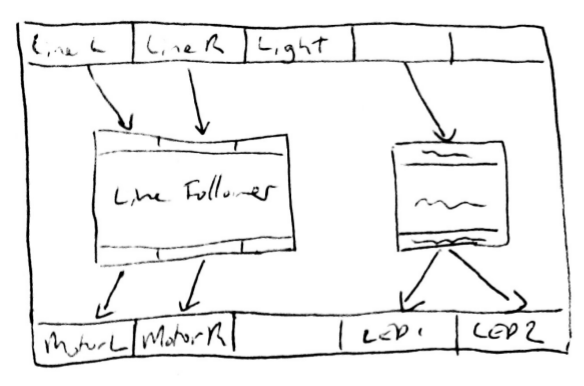
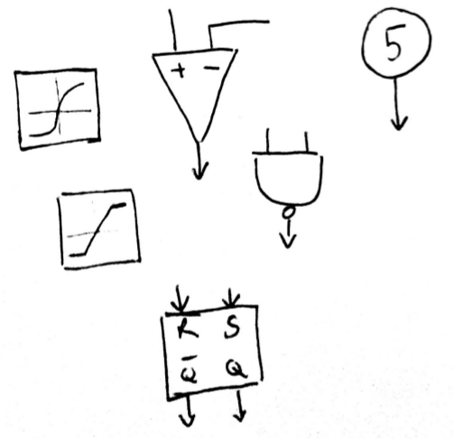

==============
 FloBot Guide
==============

Inputs and Outputs
==================

Along the top of the screen are the outputs from the sensors of
your robot -- range sensors, light sensors and switches.
Along the bottom of the screen are the inputs to the
actuators -- the motors, servos and lights.

Your task is to join them up to make the robot change its outputs
in response to changes on its inputs.  In other words, to make it
do interesting stuff.

Connecting Things
=================

To connect an output to an input, click on either end and drag to
the destination.  A curved line will appear to show you the connection,
and if that connection is allowed the line will turn green.

Outputs can be connected to multiple inputs, but each input can only
be connected to a single output.  If you try to connect multiple
outputs to a single input, the older connections will be removed.
To remove all connections from an input, click on it to start a new
connection and then leave the new connection unconnected.

.. note:: 

    Try it out!  First click on "Range Sensor" and drag a connection
    down to "Left Motor".  Now drag another connection down to "Right
    Motor".  Turn the robot on and watch what it does.  What behaviour
    is it displaying?

    Try connecting things differently, and see how the robot behaves!

Constants
=========

Constants let you introduce your own numbers into the robot -- they
have no inputs and a single output.
They are "constant" in that they always have the same value unless
you change it: unlike sensor outputs, they don't change on their own.
To change their value, click on them.  Constants can have values
between -327 and +327.

.. note::

    Try connecting a constant to the "Light".  Turn the constant
    up and down and admire the flashing lights.

Components
==========

Flobot would be pretty boring if all you could do was connect outputs
to inputs directly.  Thankfully, there's lots of components you can put
between the outputs and inputs.  Each component has multiple inputs
and outputs of its own, and changes the signals as they flow from 
sensors to actuators.

The ``<<`` button at top right opens a panel which lets you select
components.  To use them, drag them out into the main flow diagram.
To dispose of them, disconnect all their connections and then drag
them back into the panel or corner.  

.. note::

    Find the subtractor.  Connect the "Range Sensor" to the "+"
    input of the subtractor, and the output of the subtractor to 
    each motor.  Find a constant, and connect it to the "-" 
    input of the subtractor.  Set the constant value to 5.

    How has the robots behaviour changed?  How far away is it when
    it stops moving?  What does it do if you move your hand towards it?

... TBC ...
